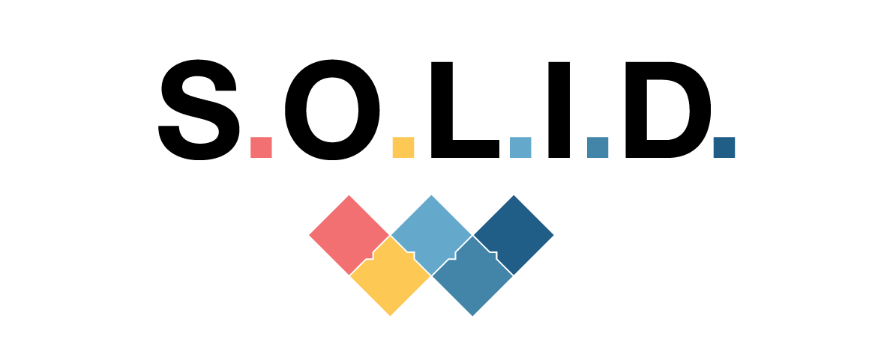

<p align="center">
    
    <br>This repository contains examples for SOLID principles
</p>

---
# What is SOLID?

SOLID is an acronym for 5 important design principles when doing OOP (Object oriented Programming). The SOLID principles were first introduced by the famous Computer Scientist Robert J. Martin (or Uncle Bob) in his paper in 2000. But the SOLID acronym was introduced later by Michael Feathers.

SOLID are five patterns to encourage us to create more maintainable, understandable, and flexible software. Consequently, as our applications grow in size, we can reduce their complexity.

Each letter from SOLID have a meaning:

<strong>S</strong> - Single-responsibility Principle </br>
<strong>O</strong> - Open-closed Principle </br>
<strong>L</strong> - Liskov Substitution Principle </br>
<strong>I</strong> - Interface Segregation Principle </br>
<strong>D</strong> - Dependency Inversion Principle </br>

---
## 1. SRP: Single-responsibility Principle

This principle means:
```
A class should have one and only one reason to change, meaning that a class should have only one job.
```

How does this principle help us to build better software? Let's see a few of its benefits:

* <strong>Testing</strong> – A class with one responsibility will have far fewer test cases.
* <strong>Lower coupling</strong> – Less functionality in a single class will have fewer dependencies.
* <strong>Organization</strong> – Smaller, well-organized classes are easier to search than monolithic ones.

#### Example:

Imagine the diagram bellow and try to identify the problems:

<p align="center">
    
</p>

```java
class Order {

    public BigDecimal calculateTotalSum() { /* code */; }
    public List<Item> getItems() { /* code */; }
    public long getItemsCount() { /* code */; }
    public boolean addItem(Item item) { /* code */; }
    public boolean deleteItem(Item item) { /* code */; }

    public void printOrder() { /* code */; }
    public void showOrder() { /* code */; }

    public void load() { /* code */; }
    public void save() { /* code */; }
    public void update() { /* code */; }
    public void delete() { /* code */; }
}

```

In this example, the class has 3 different responsibilities: store the order information, print data and manage the data/persist.

The example viole single-responsibility and causes some problems:
* Low cohesion: a class shouldn't have responsibility that is not its own.
* High couple: more responsibility, cause a lot of dependencies, making the program difficult to change.
* Testing: Difficult for testing.

Applying the SRP, we'll have this solution:

<p align="center">
    
</p>

```java
class Order {

    public BigDecimal calculateTotalSum() { /* code */; }
    public List<Item> getItems() { /* code */; }
    public long getItemsCount() { /* code */; }
    public void addItem(Item item) { /* code */; }
    public boolean deleteItem(Item item) { /* code */; }
}

class OrderRepository {
    
    public Order load(UUID id) { /* code */; }
    public boolean save(Order order) { /* code */; }
    public boolean update(Order order) { /* code */; }
    public boolean delete(Order order) { /* code */; }
}

class OrderViewer {
    public void printOrder(Order order) { /* code */; }
    public void showOrder(Order order) { /* code */; }
}
```

Now we have 3 different classes to do each responsibility. This principle should be applied as well for methods,
it means each method should have one responsibility.

---