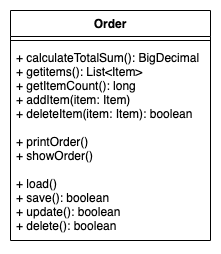
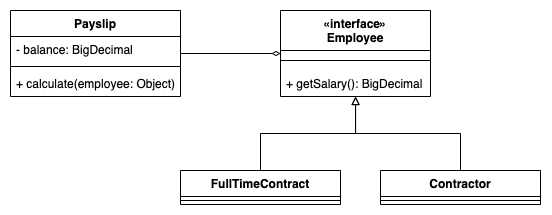
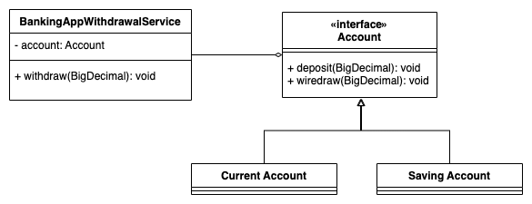
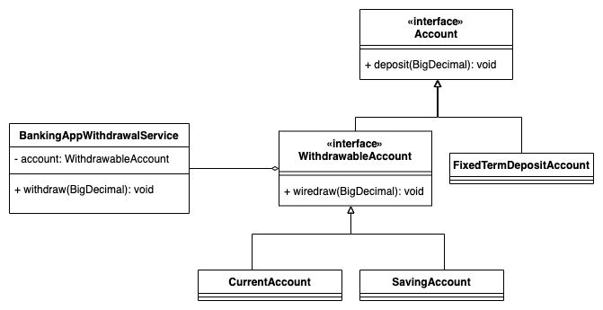

<p align="center">
    
    <br>This repository contains examples for SOLID principles
</p>

---
# What is SOLID?

SOLID is an acronym for 5 important design principles when using Object oriented Programming (OOP). The SOLID principles were first introduced by the famous Computer Scientist Robert J. Martin (or Uncle Bob) in his [paper](https://fi.ort.edu.uy/innovaportal/file/2032/1/design_principles.pdf) in 2000. But the SOLID acronym was introduced later by Michael Feathers.

SOLID are five patterns to encourage us to create more maintainable, understandable, and flexible software. Consequently, it helps programmers to write more clean code and as our applications grow in size, we can reduce their complexity. 

Each letter from SOLID has a meaning:

<strong>S</strong> - Single-responsibility Principle </br>
<strong>O</strong> - Open-closed Principle </br>
<strong>L</strong> - Liskov Substitution Principle </br>
<strong>I</strong> - Interface Segregation Principle </br>
<strong>D</strong> - Dependency Inversion Principle </br>

Below is describe each of them. 

---
## 1. SRP: Single-responsibility Principle

This principle means:
```
A class should have a single responsibility
```

This principle means that we should have only one responsibility in each class, well-written, well-separated, and definitely, with a ```single responsibility```.

This principle provides the benefits involving tests, lower coupling and code organisation. Image a big class that does everything and you need to test the behavior of the functionalities on this class, how mess can it be? and in the future when you change a small part of the code inside this class, how to know if everything will be working well after the change, it can even introduce dependent/shared code, that will be more complex to change, so if we use single responsability, we can tests only this responsability and ensure everything working well. When we have less functionality, we reduce dependences and unnecessary shared code. The organisation with smaller classes will be better and the code will be easier to read than the monilithic classes that do everything.

#### Example:

Imagine the diagram and the class bellow and try to identify the problems:

<p align="center">
    
</p>

```java
class Order {

    public BigDecimal calculateTotalSum() { /* code */; }
    public List<Item> getItems() { /* code */; }
    public long getItemsCount() { /* code */; }
    public boolean addItem(Item item) { /* code */; }
    public boolean deleteItem(Item item) { /* code */; }

    public void printOrder() { /* code */; }
    public void showOrder() { /* code */; }

    public void load() { /* code */; }
    public void save() { /* code */; }
    public void update() { /* code */; }
    public void delete() { /* code */; }
}

```

In this example, the class has 3 different responsibilities: store the order information, print data and manage the data/persist.

The example viole single-responsibility and causes some problems:
* **Low cohesion**: a class shouldn't have responsibility that is not its own.
* **High couple**: more responsibility, cause a lot of dependencies, making the program difficult to change.
* **Testing**: Difficult for testing.

Applying the SRP, we'll have this solution:

<p align="center">
    
</p>

```java
class Order {

    public BigDecimal calculateTotalSum() { /* code */; }
    public List<Item> getItems() { /* code */; }
    public long getItemsCount() { /* code */; }
    public void addItem(Item item) { /* code */; }
    public boolean deleteItem(Item item) { /* code */; }
}

class OrderRepository {
    
    public Order load(UUID id) { /* code */; }
    public boolean save(Order order) { /* code */; }
    public boolean update(Order order) { /* code */; }
    public boolean delete(Order order) { /* code */; }
}

class OrderViewer {
    public void printOrder(Order order) { /* code */; }
    public void showOrder(Order order) { /* code */; }
}
```

Now we have 3 different classes to do each responsibility and we can test each responsability. Automatically when we are using this principle we are writting better code, clean and that will be easier to read.

The SRP isn't applied only for classes, it can be applied for methods too. A method should not to do a lot of things, 
its name should be clean and the method code should do only one thing, following the principle <strong>Single Responsibility</strong>.  

---
## 2. OCP: Open-closed Principle

This principle says:

```
Classes should be open for extension, but closed for modification
```

What this principle means with **closed for modification** is, once the code is done, it should not be changed in the future.
And what this principle means with **open for extension** is, once the code is done, now we don't need to change it to add new functionalities, we just need to add the new functionality extending the existing functionalities.

The benefits:
* When we add new functionalities, it doesn't impact the existing code and we don't need to change the existing code.
* It will improve the code design.
* It avoids including bugs in the existing code.

#### Example:

Imagine we have a payment system with different type of employees. Each employment type has its own method to return the salary.

So, in this example bellow, we have a FullTime employment type and a Contractor, and a class to calculate the payslip that requires the salary. What is the problem with this code?

<p align="center">
    
</p>

```java
class FullTimeContract {
    public BigDecimal salary() {
        return null;
    }
}

class Contractor {

    public BigDecimal payment() {
        return BigDecimal.ZERO;
    }
}

class Payslip {
    
    private BigDecimal balance;
    
    void calculate(Object employee) {
        if (employee instanceof FullTimeContract) {
            balance = ((FullTimeContract) employee).salary();
        } else if (employee instanceof Contractor) {
            balance = ((Contractor) employee).payment();
        } else {
            throw new IllegalArgumentException("Invalid employee type: "
                    + employee.getClass().getName());
        }
    }
}
```

The problem in this class is that, if the system needs to be modified to accept another type of employment/contrat, we need to change the existing code in `Payslip` class to support the new type.
In a `closed principle` we cannot change the existing code.

A class should be closed for modifications, and Uncle Bob teaches us how to fix it:
`Separate extensible behavior behind an interface, and flip the dependencies.`

Let`s refactoring the code and see how it looks:

<p align="center">
    
</p>

```java
interface Employee {

    BigDecimal getSalary();
}

class FullTimeEmployee implements Employee {

    @Override
    public BigDecimal getSalary() {
        return null;
    }
}

class ContractorEmployee implements Employee {
    
    @Override
    public BigDecimal getSalary() {
        return null;
    }
}

class Payslip {

    private BigDecimal balance;

    public void calculate(Employee employee) {
        this.balance = employee.getSalary();
    }
}
```

In the new version of the code, we have an interface `Employee`, and the payslip manage an implementation of Employee, it gives us the flexibility to implement how much types of employee we want and we don't need to change the existing Payslip anymore.

`Now our class is closed for modifications, and open for extensions.`

Open-Closed Principle is the base of the [Strategy](https://en.wikipedia.org/wiki/Strategy_pattern) Design Pattern. According to the strategy pattern, we should use interface instead inherited, so it is compatible with the OCP.

---
## 3. LSP: Liskov Substitution Principle

This principle says:
```
If S is a subtype of T, then objects of type T in a program may be replaced with objects of type S without altering any of the desirable properties of that program.
```

Here we are using Inheritance where we have a Class and we create another Class from it, we classify these classes as parent class and child class, or superclass and subclass. The child class should be able to do everything that the parent class does. A parent class can have many child as the software needs them.

When we look at this definition for the first time, it looks just a definition of OOP concept of polymorphism, but it's more, believe in it!

This principle says about consistency between superclasses and subclasses, avoiding unexpected exception and wrong abstraction. It will make more sense when we go thought the example. 

Let's assume the following diagram and example, where we have an account and two types of accounts that supports the operations `deposit` and `withdraw`. Also we have a BankingAppWithdrawalService that is used to call the withdraw operation.

<p align="center">
    
</p>

```java
public interface Account {

    void deposit(BigDecimal amount);

    void withdraw(BigDecimal amount);
}

public class CurrentAccount implements Account {

    @Override
    public void deposit(BigDecimal amount) {
        // implementation
    }

    @Override
    public void withdraw(BigDecimal amount) {
        // implementation
    }
}

public class SavingAccount implements Account {

    @Override
    public void deposit(BigDecimal amount) {
        // implementation
    }

    @Override
    public void withdraw(BigDecimal amount) {
        // implementation
    }
}

public class BankingAppWithdrawalService {

    private Account account;

    public BankingAppWithdrawalService(Account account) {
        this.account = account;
    }

    public void withdraw(BigDecimal amount) {
        account.withdraw(amount);
    }
}
```

Now let's suggest that the bank wants to offer a high interest-earning fixed-term deposit account to its customers, so we can intruduce in our application the `FixedTermDepositAccount` that supports only `deposit` because of the bank offer. The first thing that comes to us is: `FixedTermDepositAccount is an Account`, and then we can just implement the Account interface, but in this scenario we are introduction a problem, Account supports deposit and withdraw operations and we need to implement the `withdraw` method. It is most common than you immagine to find code where this method is implemented and throws an exception for unsupported operation. Let's see our new diagram and the new class:

<p align="center">
    
</p>

```java
public class FixedTermDepositAccount implements Account {

    @Override
    public void deposit(BigDecimal amount) {
        // implementation
    }

    @Override
    public void withdraw(BigDecimal amount) {
        throw new UnsupportedOperationException("Withdrawals are not supported by FixedTermDepositAccount!!");
    }
}
```

#### What is the problem here?

`FixedTermDepositAccount` definetely is an `Account`, therefore, we cannot reliably substitute `FixedTermDepositAccount` for `Account` and keep the same behavior because even if `FixedTermDepositAccount` implements the method throwing an exception

`FixedTermDepositAccount` has violated the Liskov Substitution Principle.

#### How to apply LSP in this case?

We should re-design the application to follow the LSP principle. One possible solution is Create a new `WithdrawableAccount` interface that supports the `withdraw` method. Let's take a look:

<p align="center">
    
</p>

```java
interface Account {

    void deposit(BigDecimal amount);
}

interface WithdrawableAccount extends Account {

    void withdraw(BigDecimal amount);
}

class FixedTermDepositAccount implements Account {

    @Override
    public void deposit(BigDecimal amount) {
        // implementation
    }

}

class CurrentAccount implements WithdrawableAccount {

    @Override
    public void deposit(BigDecimal amount) {
        // implementation
    }

    @Override
    public void withdraw(BigDecimal amount) {
        // implementation
    }
}

class SavingAccount implements WithdrawableAccount {

    @Override
    public void deposit(BigDecimal amount) {
        // implementation
    }

    @Override
    public void withdraw(BigDecimal amount) {
        // implementation
    }
}

class BankingAppWithdrawalService {

    private WithdrawableAccount account;

    public BankingAppWithdrawalService(WithdrawableAccount account) {
        this.account = account;
    }

    public void withdraw(BigDecimal amount) {
        account.withdraw(amount);
    }
}

```

Now the `BankingAppWithdrawalService` only supports withdrawable accounts and `FixedTermDepositAccount` doesn't need to throws an unexpected exception as before.

Tips:

* When thinking in Inheritance, be careful using `is a` creating subclasses.
* Some more examples: We can have a system with a class `Bird` and method `fly()`, but not every bird `flies`. We can have a interface `Transport` that supports moviments for all directions, straigh, back, right and left and a class `Car` implementing them, but when implementation a `Train`, it goes only `straight` and `back`.
* Breaking LSP, we introduce bugs and bad software design.

---
### Sources:

* https://www.baeldung.com/solid-principles
* https://medium.com/backticks-tildes/the-s-o-l-i-d-principles-in-pictures-b34ce2f1e898
* https://medium.com/desenvolvendo-com-paixao/o-que-%C3%A9-solid-o-guia-completo-para-voc%C3%AA-entender-os-5-princ%C3%ADpios-da-poo-2b937b3fc530
* https://www.baeldung.com/java-liskov-substitution-principle
